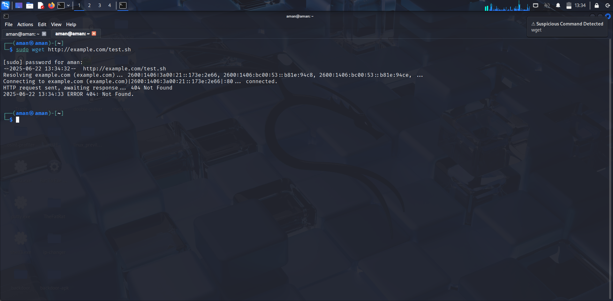

# 🔐 Linux Privileged Session Monitoring System

## 📌 Overview
This is a real-time monitoring system for Linux that detects suspicious privileged command activity (e.g., `wget`, `nc`, `rm -rf`) and generates desktop alerts. Built using `auditd`, `Python`, and `notify-send`.

## 🚀 Features
- Watches for root-level or sudo activity via `auditd`
- Sends desktop notifications using `notify-send`
- Avoids spam by alerting only once per command type every 5 minutes
- Runs continuously in the background as a `systemd` service
- Easy to install and extend

## 🔧 Technologies Used
- Python 3
- auditd (Linux audit daemon)
- libnotify-bin (notify-send)
- systemd (for persistence)

## 📂 File Structure

/opt/priv_alerts.py # The main Python script

/etc/audit/rules.d/privmon.rules # auditd rule definitions

/etc/systemd/system/priv-alert.service # systemd unit file

## 📸 Live Preview

> Here's what it looks like in action!

### ✅ Desktop Notification (via notify-send)



## 🛠️ Installation Steps

### 1. Install dependencies
```bash
sudo apt update
sudo apt install -y auditd libnotify-bin python3
```
2. Add audit rules

```bash
sudo nano /etc/audit/rules.d/privmon.rules
```
4. Copy the Python script

```bash
sudo cp priv_alerts.py /opt/
sudo chmod +x /opt/priv_alerts.py
```

5. Create the systemd service

```bash
sudo cp priv-alert.service /etc/systemd/system/
sudo systemctl daemon-reexec
sudo systemctl daemon-reload
sudo systemctl enable --now priv-alert.service
```

🧪 Test It

```bash
sudo wget http://example.com/fake.sh
sudo nc -lvp 4444
```
You will receive a desktop pop-up if the command is on the watchlist.
